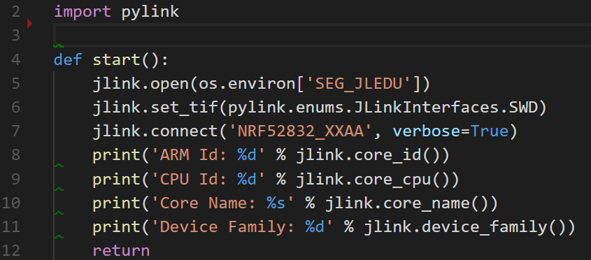
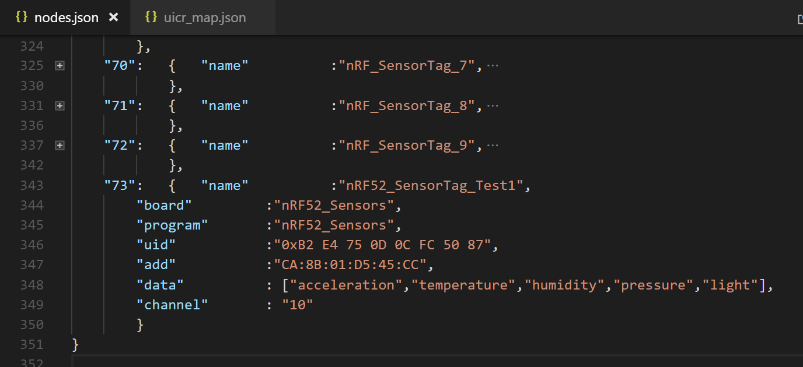
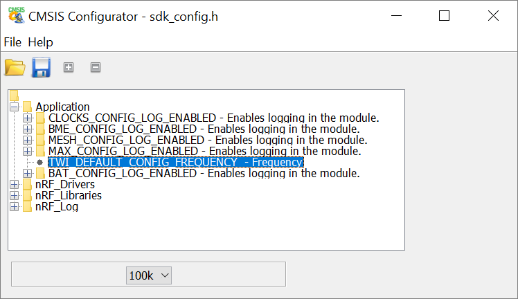
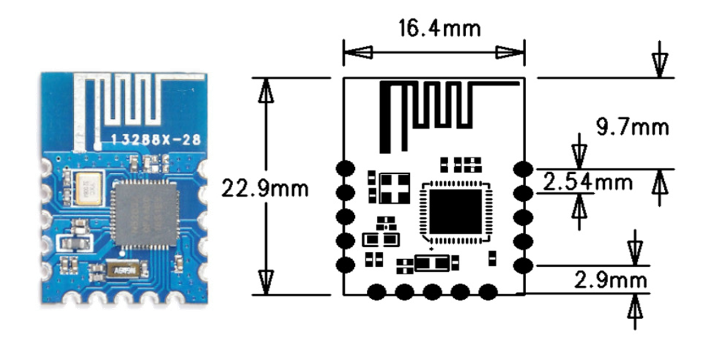
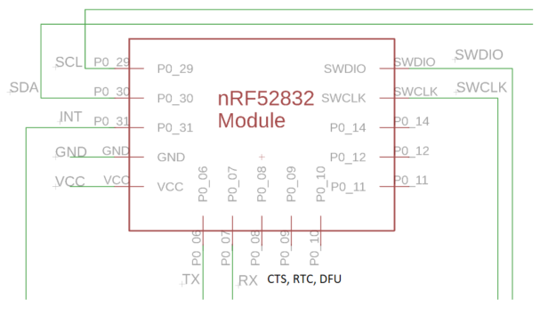
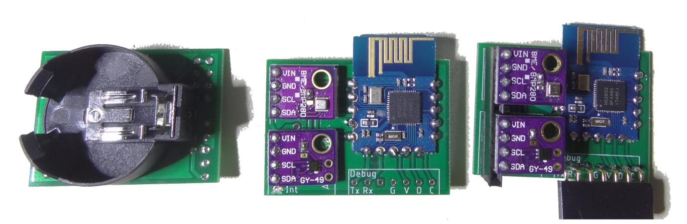
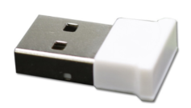
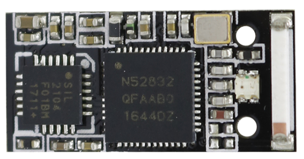
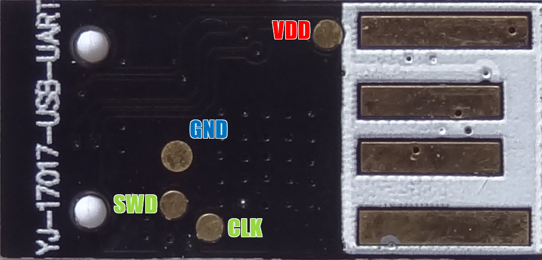
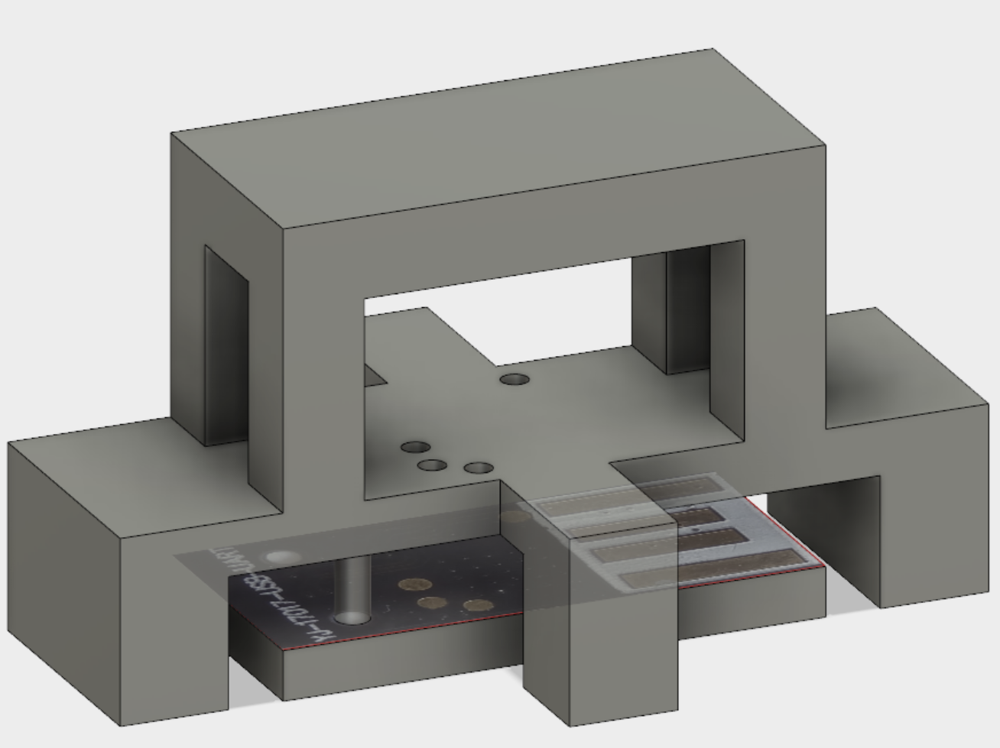

# Presentation and Documentation on [Home Smart Mesh](https://www.homesmartmesh.com/)
This readme is an extract from [Home Smart Mesh](https://www.homesmartmesh.com/) with focus on software configuration and protocol implementation details

# The content of [this repository](https://github.com/nRFMesh/nRF52_Mesh)
## ./raspi/
The server's python scripts running also on a raspberry pi
* ./raspi/conbee : the ConBee script to turn the Xiaomi Zibbee devices events into MQTT
* ./raspi/rf_uart : the interface to the serial port that transfers data between MQTT and the RF mesh
* ./raspi/rf_stm32 : interface to leagacy devices, bed heater and retro light
* ./raspi/mesh_wizard/ : The web interface for real time view of the mesh with webgl, uses a websocket to connect to the MQTT broquer
* ./raspi/ruler/ : json configurable rules through sensors and actuators MQTT topics and a separate python rules file
* ./raspi/influx/ : the [influx](https://www.influxdata.com/time-series-database/) client that listens to MQTT and grabs standard sesnors patterns to be sent to the database
* ./raspi/grafana : [Grafana](https://grafana.com/grafana) is used as a dashboard, it is a webserver interface that is installed on the raspberry pi (or on the docker image). Some dashboards examples are provided in this directory, where the queries are matching the way how the influx client has recorded the sensors data. 
* ./raspi/wemo/ : The wemo switch smart socket interface, provides power sensing and sends the Watt value to MQTT
* ./raspi/milight : The milight RF gateway client (require the wifi to RF milight bridge HW)
* Data collection into a time series database 

## ConBee Zigbee to MQTT example

    jNodes/96/button {"event": "flip", "from": 4, "to": 2}
    jNodes/96/button {"event": "flip", "from": 2, "to": 4}
    jNodes/96/button {"event": "flip", "from": 4, "to": 6}
    jNodes/96/button {"event": "push", "face": 6}
    jNodes/96/button {"event": "flip", "from": 6, "to": 3}
    jNodes/96/button {"event": "shake"}
    jNodes/96/button {"event": "double_tap", "face": 3}
    jNodes/96/button {"rotation": -1377}
    jNodes/96/button {"rotation": 8140}
    jNodes/96/button {"event": "flip", "from": 1, "to": 2}
    jNodes/96/button {"event": "flip", "from": 1, "to": 6}
    jNodes/96/button {"event": "flip", "from": 2, "to": 6}
    jNodes/96/button {"event": "flip", "from": 4, "to": 1}
    jNodes/96/button {"event": "flip", "from": 1, "to": 4}
    jNodes/96/button {"event": "wakeup"}
    jNodes/96/button {"event": "flip", "from": 4, "to": 1}
    jNodes/96/button {"event": "shake"}
    jNodes/96/button {"event": "double_tap", "face": 1}
    jNodes/96/button {"event": "flip", "from": 5, "to": 1}
    jNodes/96/button {"event": "flip", "from": 1, "to": 5}
    jNodes/96/button {"rotation": 6288}
    jNodes/96/button {"rotation": -4747}

## rf_stm32

    mosquitto_pub -t 'Bed Heater' -m '{"heat":4,"time_mn":1}'
    mosquitto_pub -t 'Retro Light Upstairs/all' -m '2000'

## hue test vector

    mosquitto_pub -t 'zigbee/lumi.sensor_motion.aq2/MotionLight 1' -m '{"presence": true}'
    mosquitto_pub -t 'zigbee/lumi.sensor_motion.aq2/MotionLight 1' -m '{"light": 24}'
    mosquitto_pub -t 'zigbee/SML001/MotionLightHue' -m '{"presence": true}'
    mosquitto_pub -t 'zigbee/SML001/MotionLightHue' -m '{"light": 24}'
    

## ./boards/
Schematics, PCBs and boards headers for the SensorTag and the Dongle used by the nRF52 firmware

## ./applications/
The nRF52 firmware grouped in project directories each containing the "main.c", "Makefile" and other project configuration files
* ./applications/nrf52_sensortag/ : Low power Custom Sensor application with BME280 and MAX44009 (currently @22 uA)
* ./applications/nrf52_dongle/ : Reprogrammed USB dongle from the market
* ./applications/nrf52_accel/ : Motion detection Tag

## ./drivers/
Contains the specific drivers for this project from which the "mesh.c" a light weight Mesh Protocol connecting all the devices using a custom RF protocol (without softdevice)
* Sleepy nodes (low power) and router nodes (always listening)
* single layer ultra simple rpotocol. App into mac with unique ids to small ids mapping
* An alternative to the Bluetooth Mesh and Zigbee Thread IPV6 world

## ./tools/
Contains the fancy Makefile extensions that allow :
* switch power on and off using a Segger jlink
* read and write parameters matching the device's unique identifier read from the HW registers

## ./nRF5_SDK_15.0.0_prf/
This is a submodule that minifies the nRF15 SDK for the content required by this repository.
When compiling the nRF applications firmware don't forget to call the submodule update command, it is also possible to do that without git by going to the repository link, downloading it and placing it under the same path. Although if you do not use git command line at this stage, you might want to consider following a git tutorial.

    git submodule update --init

# Dependencies
* For the Raspberry pi tools and scripts see full installation steps in the [Installation](https://www.homesmartmesh.com/install/) website page
* For the nRF52 firmare :
    * GNU Tools ARM Embedded version 6 2017-q2-update, referenced from the SDK Makefile.windows
    * Python [jlink wrapper](https://github.com/square/pylink). Used in Makefile and tools of this repo, more on [pylink.readthedocs](http://pylink.readthedocs.io/en/latest/pylink.html). Note that it has to be used with a 32 bit python version referenced in the tools scripts as **C:\Python27\python.exe**. wrapper scripts already availabe in the tools directory

## Details about the nRF52 Frimware environment



* System variable **NODES_CONFIG** should point on a json configuration file, see an example at [node.json](https://raw.githubusercontent.com/HomeSmartMesh/IoT_Frameworks/master/config/nodes.json) or the screenshot below



The parameters here are used by external tools to have a consistent undersanding of the mesh network. From simple id to name translation, to location display according to coordinates down to user data flashing.

## Cool defines and data configuration
### sdk config tool
Once in the application directory just use ```make conf``` to call a cmsis [configuration wizard](http://helmpcb.com/software/cmsis-configuration-wizard), as provided in the SDK. Note that it was here extended to make the user drivers shared and configurable as well, e.g. the I²C frequency of the **Application** in the screenshot



### Automated mesh devices configuration
 User data flashing is done with Pylink which reads in [uicr.py](tools\uicr.py) the registers of the attached device, look it up in the **NODES_CONFIG** file, retrives which parameters should be flashed, the mapping of parameters to CUSTOMER_X registers come from "uicr_map.json".

## simple board switch
The repo contais a directory for boards declaration "boards/" and a directory for applications "applications/". Although every application targets a particular board, it is possible to use any application for any other board. In the makefile a sinlge line has to be edited

    USED_BOARD := BOARD_NRF52_SENSOR_TAG

# Doxygen Documentation
* install [Doxygen](www.doxygen.org/)
* run

    gen_doc.bat

Yes this is only wrapping ```doxygen Doxyfile``` but just take it as a workspace local alias
# nRF52 Sensor Tag
This board is based on modules, it is very simple to solder and allows selection of any other I²C sensor modules.

## Design
### Module


### Schematics
Here a screenshot of the schematics which design files are also available in the [board subdirectory](boards/nrf52_sensortag/pcb)



## Mounted PCBs
It is possible to mount either CR2032 or CR2477



It is based on a market available nRF52832 module seen below


## Low Power configuration
|Flags to clear|
--- |
| NRFX_UARTE_ENABLED |
| NRFX_UART_ENABLED | 
| UART_ENABLED | 
| UART0_ENABLED |
| NRF_FPRINTF_ENABLED |
| NRF_LOG_BACKEND_UART_ENABLED |
| NRF_LOG_STR_FORMATTER_TIMESTAMP_FORMAT_ENABLED |
| NRF_LOG_ENABLED |
* removed nrf_drv_uart.c from Makefile
* Required nRF52832 Errata [89] TWI: Static 400 uA current while using GPIOTE


## Low Power measures
| Mode | Current |
--- | --- |
| RTC + RAM | 9.6 uA |
| // + Sensors | 22 uA |
| // without TWI Woraround | 470 uA |
| Uart Log | 500 uA |
| Uart Log + HF | 700 uA |


# nRF52 Dongle
## Software
### RF to Serial Gateway
The node connected through serial port will report messages in text format
1. Local Events

Upon startup such message is sent

    nodeid:75;channel:10;reset:1

2. Listening

Upon activation of the uicr config ```is_listening``` the node starts acting as a gatewy that will report messages through serial in text mode

    rssi:-50;id:73;ctrl:0x81;src:73;alive:68;tx_power:0

3. commands requests and responses

It is possible to reconfigure the Node on runtime and manage manage a mesh network by sending messages

    cmd:0x0102
    cmd:0x<command id><arguments>

| Command id | Function | Parameters |
--- | --- | --- |
| 0x01 | Set Node Id | Mode Mesh Short Identifier|
| 0x02 | Get Node Id | |
| 0x03 | Set RF Channel | 0:2400 MHz - 100:2500 MHz|
| 0x04 | Get RF Channel | |
| 0x05 | Set Tx Power | 0x04: +4dBm - 0xD8: -40dBm|
| 0x06 | Get Tx Power | |
| 0x07 | Set Bitrate | tbd |
| 0x08 | Get Bitrate |
| 0x09 | Set CRC | 0 : No CRC - 1 : 8bit - 2 : 16 bit|
| 0x0A | Get CRC |  |
| 0x0B | Set UICR | used uicr registers |
| 0x0C | Get UICR |  |


### Command examples
Set channel 10/0x0A

    cmd:0x030A

get channel

    cmd:0x04

Set Tx Power to  -4dBm/0xFC

    cmd:0x05FC

Set UICR e.g. RF Channel @ CUSTOMER[1] to channel 10

    cmd:0x0B010A

Send message, directed (not broadcast) with ttl = 2, ping(75/0x4B) from 73/0x49

    msg:0x7201494B

Send message to execute on the RF target node 75/0x4B the command Set Tx Power to -4 dBm

    msg:0x72EC494B05FC

Send message to execute on the RF target node 75/0x4B the command Set channel to 0x0A

    msg:0x72EC494B030A

Send request to execute on the RF target node 75/0x4B the command Set channel to 0x0A
The only difference to the previous example is that an intermediate ack for the request is not required before getting the response

    msg:0x22EC494B030A

### Switch between serial SERIAL and LOG over UART
run

    make conf

then switch both flags :
* nRF_Log/NRF_LOG_BACKEND_UART_ENABLED
* Application/APP_SERIAL_ENABLED
don't forget to save

### Serial mode
* NRF_SERIAL_MODE_IRQ flag is not used by the driver and has equivalent function as NRF_SERIAL_MODE_DMA

* ser_send() must be used with a variable in memory as DMA cannot read from Code in Flash

## Hardware

Why reinvent the wheel ? When it comes to a Server interface as a dongle, we can reuse a usb dongle from the market that includes a **2104** serial to usb converter. Keyword search on shopping websites : **nRF52832 USB dongle**. Aka "nRF52832-YJ-17017-USB-UART"


<br/>

## From the inside



<br/>

## pinout
| nRF52 | pin |
--- | --- |
| Rx | P0.05 |
| Tx | P0.06 |
| CTS | P0.07 |
| RTS | P0.08 |
| LED1 | P0.28 |
| LED2 | P0.29 |


## Needle adapter
Making a needle adapter is made easier with 3d printing. The used pogo pin is seen below


The adapter model still in preparation can be found [here](https://a360.co/2IcKZK9). It should look something like this:


<br/>


# Raspi Host Controller Interface

## HCI MQTT Test vector

### Commands
get mesh node id of attached dongle

    mosquitto_pub -t 'cmd/request/get_node_id' -m ''

Response

    cmd/response/get_node_id {"cmd": "get_node_id", "node_id": "73"}

get channel of attached dongle

    mosquitto_pub -t 'cmd/request/get_channel' -m ''

Response

    cmd/response/get_channel {"cmd": "get_channel", "channel": "2"}

### Remote Commands
Request to set remote node 74 on RF channel 2

    mosquitto_pub -t 'remote_cmd/request/set_channel' -m '{"channel":2,"remote":74}'

Response

    remote_cmd/response/set_channel {"pid": "236", "ctrl": "0x02", "src": "74", "dest": "73", "cmd": "set_channel", "set": "2", "get": "2"}

### Actions
Ping node 74

    mosquitto_pub -t 'Nodes/79/ping' -m '{"remote":"74"}'

Aknowledge

    Nodes/79/ack 1
