# Features
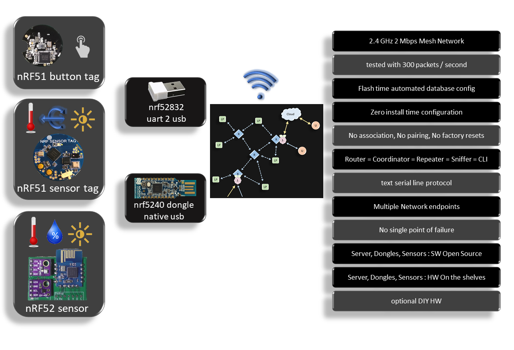

* 2.4 GHz 2 Mbps Mesh Network
  * tested with 300 packets / second
* Flash time automated database config
* Zero install time configuration
  * No association, No pairing, No factory resets
* Router = Coordinator = Repeater = Sniffer = CLI
* text serial line protocol
* Multiple Network endpoints
  * No single point of failure
* Server, Dongles, Sensors
  * Full Stack Open Source (no softdevices required)
  * HW On the shelves
  * optional DIY HW
* Alive trace routing
  * a heartbeat message that gives info about the age and RF tx/rx hops through the route

see below the [Drivers & Custom Mesh protocol](#Drivers-&-Custom-Mesh-protocol) section for the RF Protocol details

# Description
* 2 Mbps (e.g. Zgibee is at 250 Kbps to have a higher range), lowering the bitrate does not improve the range enough to get rid of repeaters, and once you need repeaters these are continuous listeners and require permanent power anyway, so the strategy is to have a repeater for every slot of the house and those repeaters can have power amplifiers and the range problem is solved keeping the high bitrate feature.
* successfull stress tests including up to 300 packets / second.
* This [nodes.json](./nodes.json) configuration file contains the short id for device unique identifier (uid64) and other configurations such as the channel, the sleep time, the required function,... Note that a python script using jLink API automate the flashing process as the uid is read every time from the attached device and matches the parameters to be flashed from the config file.
* As the short id (8 bits) is flashed, there is no association process required and all sensor devices can act as a pure beacons (no listening required) which considerably increases battery life time. We can keep arguing about the need of an acknowledged protocol for sensors logging, I do not think it is required as the feedback of battery level and rssi are both logged as well so the user knows if the sensor is in a healthy position or not.
* Router = Coordinator = Repeater = Sniffer = CLI : actually, a configuration activates the repeat functionality in case someone wants a completely stealth sniffer and this config does not require a different FW. There is nothing to coordinate as the mesh is fully dynamic with a flood and time to live concept. And every dongle has a CLI in text mode to report heard packets and takes commands as text input.
* A consequence of the simplified design allows to have multiple dongles in different locations listening to the network and reporting it to mqtt which avoids any single point of failure. By design there is no id 0 privileged coordinator and end devices do not require to know any particular associated address, they just wake up, broadcast and sleep.
* As visible in the gif animations below, Open Source SW is provided for all steps, devices firmware and server python code.


# Static Demo

* [UART : dongle firmware - directory](https://github.com/nRFMesh/nRF52_Mesh/tree/master/applications/04_uart_dongle)
* [USB : dongle firmware - directory](https://github.com/nRFMesh/nRF52_Mesh/tree/master/applications/08_usb_dongle)

    cu -l /dev/ttyACM0 -s 460800 

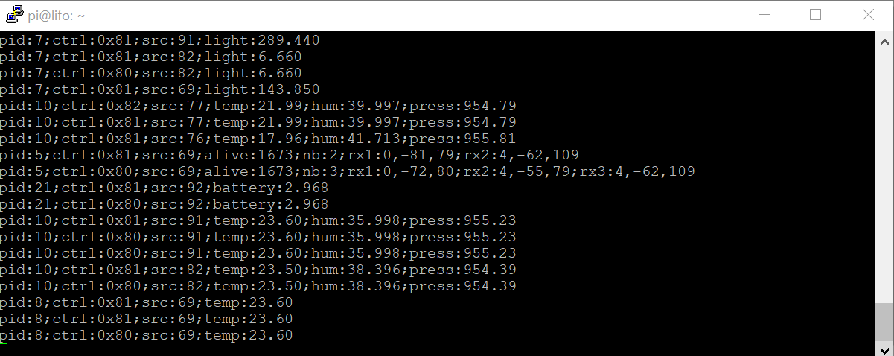

subscribe to topic

    mosquitto_sub -t 'nrf/#' -v | ts

start nrf_mesh [py/nrf_mesh](https://github.com/HomeSmartMesh/raspi/tree/master/py/nrf_mesh) from [raspi](https://github.com/HomeSmartMesh/raspi/) Project


    python3 nrf_mesh.py

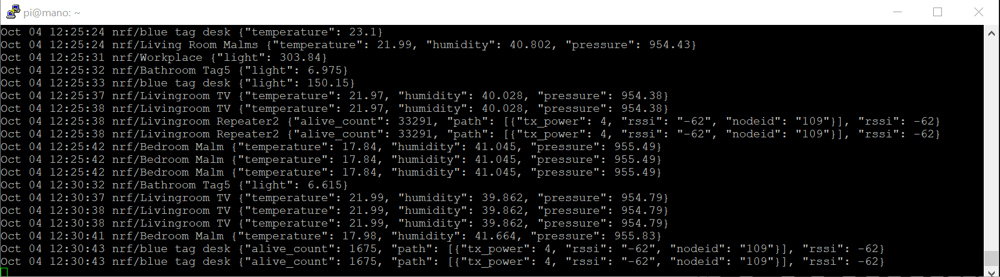

This custom sensors RF mesh can expand to cover a home area. Onces connected to services provided in the [raspi](https://github.com/HomeSmartMesh/raspi) project, including python scripts, influxdb and grafana, the end result dashboard looks like this

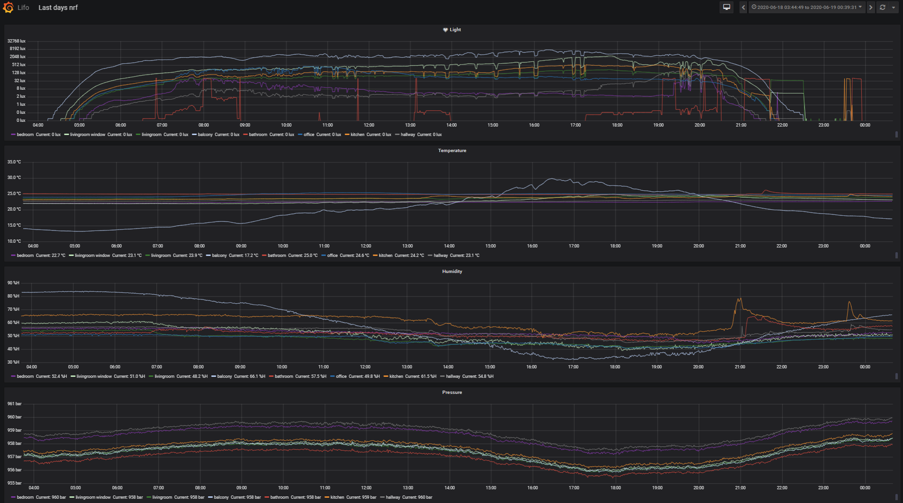

---

# nRF52 Applications
    cd ./applications/

only the main applications are listed here, for further details about all applications see below the [More nRF52 Applications](#More-nRF52-Applications) section

## 01 sensor tag
    application/01_sensortag> make flash

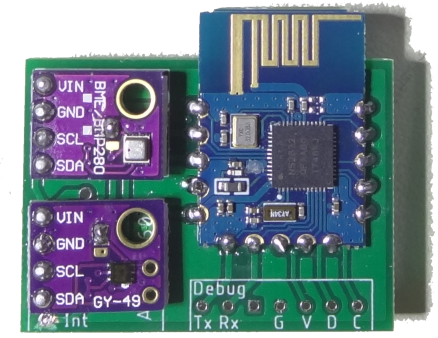

* Status : deployed > 1 year
* nRF52832 module
* Temperature, Humidity, Pressure : BME280
* Light : MAX44009
* Smooth graphana logs with cyclic broadcast ~ 30 sec => battery life ~ 6 month on CR2032

## 04 uart dongle
    application/04_uart_dongle> make flash


* Status : deployed > 1 year
* buy : "nRF52832 BLE USB UART dongle"
* custom firmware and pogo-pins jtag adapter see below
* RF Mesh repeater + RF Mesh to Host interface

## 08 usb dongle (nRF52840-dongle)
    application/08_usb_dongle> make flash

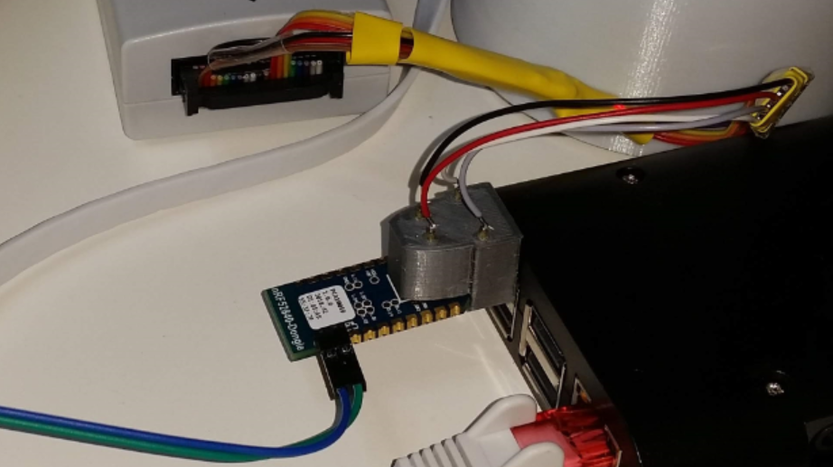

* buy : "nRF52832 dongle"
* custom firmware for RF mesh
* pogo-pins jtag adapter 3dprint : [Fusion360 CAD model](https://a360.co/2CDqeTA)
* RF Mesh repeater + RF Mesh to Host interface
* TODO : add fifo to buffer USB CDC Tx packets (to prevents drops and go > 64 bytes)

---

# Drivers & Custom Mesh protocol

    cd ./drivers/

## ./drivers/

Contains the custom drivers for this project from which the [mesh.c](./drivers/mesh.c) a light weight Mesh Protocol connecting all the devices using a custom RF protocol (without softdevice)
* Sleepy nodes (low power) and router nodes (always listening)
* single layer ultra simple rpotocol. App into mac with unique ids to small ids mapping
* A simple alternative to the Bluetooth Mesh and Zigbee Thread IPV6


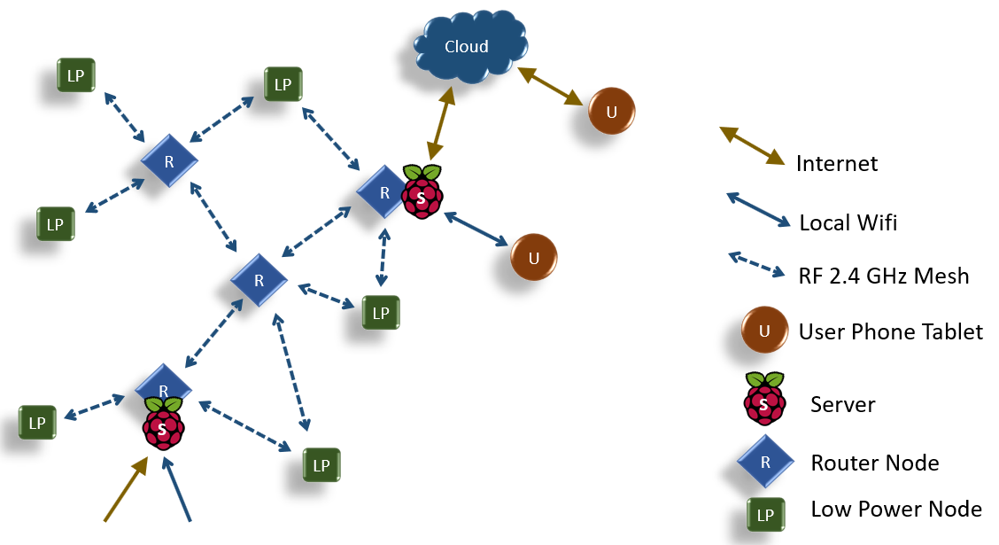

* Low power node : Mesh node that can be a sensor Tag that wakes up on RTC or on sensor value interrupt to log a parameter. Can also be a button that wakes up on a press PIO interrupt.
* Router node : Mesh node that cooperates with the Low power nodes, the router has to be a device that keeps listening permanently on the same RF channel, this might require ~ 13 mA. Example router devices are light controllers, server’s RF dongle or USB powered sensors and status devices.
* Server : A Raspberry pi running linux. The RF signals come through the serial port or with a USB adapter, then published on MQTT, from which Python scripts inject signals on the Database, connected to Grafana web server. Note that there can be multiple router dongles connected to servers.

## Protocol Overview

The Home Smart Mesh project introduce an RF Mesh protocol which is a complete stack implementation to allow devices to communicate in a Mesh Network Topology. This protocol implementation is using the nRF SDK 15 it is using the Radio module through a modified Enhanced Shock-burst custom protocol. Implementations range from nRF24L01+ with an STM8L and STM32 to the nRF51 and nRF52 families that add features such as RSSI and bigger packets sizes.

## Protocol Description

* 100% Open source Mesh RF Stack
* Ported on STM8L, STM32, nRF51 and nRF52
* Concept designed for Low Power Nodes and Router Nodes
* Same radio channel configured for the whole network
* Single channel allows maximum power save with unlimited sleep periods, and random wake up with button press or sensor event.
* Mesh with flooding broadcast, where every message has its own configurable time to live. This brings multiple advantages of usage simplicity.
* Short addresses allow efficient packets sizes. Possibility for extensions with short address reuse and exception addresses to allow unlimited network size.
* For simplicity purpose, security is a matter of application payload content.
* The stack is so small that the RAM and ROM are left for the application logic, not requiring a network co-processor.

### Protocol Mesh Broadcast
* A simple flood mechanism is implemented where every router repeats the signal heard decrementing the time to live to avoid infinite propagation.
* Future extensions can extend the routing by gathering statistics and deciding of the optimal path in a decentralized fashion. Note that small installations in a home do not bring any significant advantage, thus the interest for a simple protocol for such use case.

### Protocol Mesh Directed messages with ack
* This type of communication uses a source and destination addresses
* Only the node recognizing itself as destination will send a packet as acknowledge
* The acknowledge packet is propagated the same way, until it reaches the source, which make it an end to end acknowledge
* If the source did not got an acknowledge back while it was requested, it can retry the transmission again.

## Packet Format

custom stack vs softdevices : This protocol is using the direct Radio module capabilities and does not require the sofdevices. The softdevices are Nordic firmware that are closed source and distributed as binaries, they have higher privileges than the user application. Softdevices guarantee that the RF functions keep always working as the user application is untrusted. This comes at a big price to pay, as the rest of the SoC cannot be properly used, no free configuration of interrupts for example, they have also a big memory footprint that prevents safe double paged firmware updates.

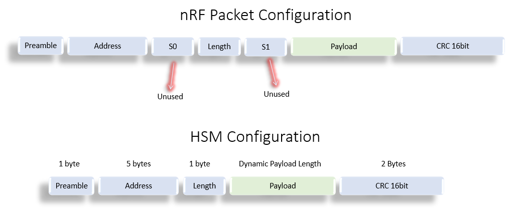

The configuration has discarded the usage of S0 and S1 which are intended for compatibility with other protocols which require a certain number of bits on the air that do not map to 8 aligned to form bytes in memory.

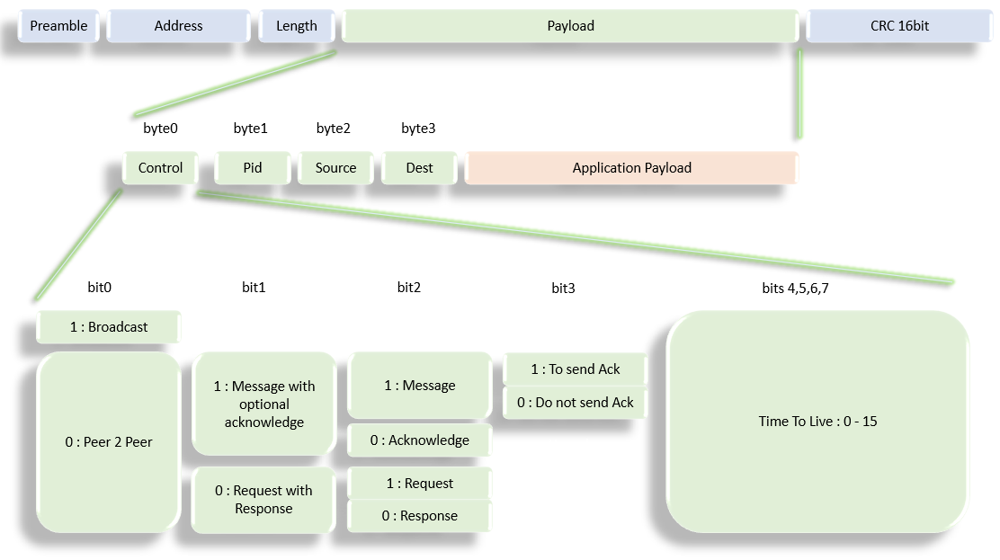

the RF Payload Format contains another software header. That is the header used to manage the packets in the mesh network.


* control: bit 7 defines whether a packet is to be broadcasted or has a target destination. Bits 6 and 5 allow safe communication with acknowledge, and a request response type. That allows the sw stack to handle the acknowledge and re-transmission. bit 3 allows streaming of messages without acknowledge.
* pid: is defining the application function which maps to a particular payload serialization
* Source and dest: are the Node Id, and are unique within every mesh. Although 8 bits, exceptions allow further reserved sizes.
* Time to live : used by the routers to know when to drop the packet.

## Alive trace routing

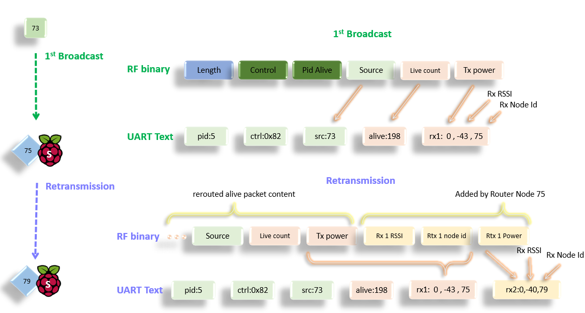

* All Nodes including the low power, send a periodic “alive” packet
* The initiator includes a counter that informs about the live cycle count
* Every retransmission appends information about
  * Received RSSI (Radio Signal Strength Indicator)
  * The Node Id of the Router performing the re transmission
  * Transmission power with which the packet has been re transmitted

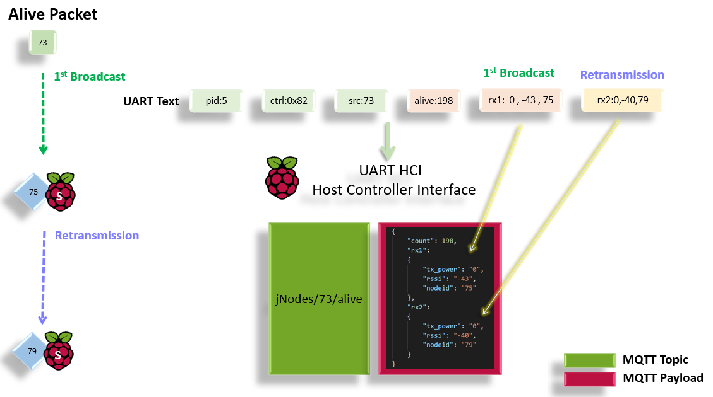

* The “alive” packet that reaches the server’s dongle has the full route information
* Multiple paths can reach the server for the same original broadcast
* A single “alive” packet can provide link status of the complete mesh netwrok
* The signal route information is packed in a json structure
* json structures are broadcasted on the jNodes topics path

---

# Printed Circuit Boards
    cd ./boards/

Schematics, PCBs and boards headers for the SensorTag and the Dongle used by the nRF52 firmware

## ./tools/
Contains the fancy Makefile extensions that allow :
* switch power on and off using a Segger jlink
* read and write parameters matching the device's unique identifier read from the HW registers

## ./nRF5_SDK_15.0.0_prf/
This is a submodule that minifies the nRF15 SDK for the content required by this repository.
When compiling the nRF applications firmware don't forget to call the submodule update command, it is also possible to do that without git by going to the repository link, downloading it and placing it under the same path. Although if you do not use git command line at this stage, you might want to consider following a git tutorial.

    git submodule update --init

# Dependencies
* For the Raspberry pi tools and scripts see full installation steps in the [Installation](https://www.homesmartmesh.com/install/) website page
* For the nRF52 firmare :
    * GNU Tools ARM Embedded version 6 2017-q2-update, referenced from the SDK Makefile.windows
    * Python [jlink wrapper](https://github.com/square/pylink). Used in Makefile and tools of this repo, more on [pylink.readthedocs](http://pylink.readthedocs.io/en/latest/pylink.html). Note that it has to be used with a 32 bit python version referenced in the tools scripts as **C:\Python27\python.exe**. wrapper scripts already availabe in the tools directory

## Details about the nRF52 Frimware environment


* `nodes.json` is provided locally in this repo and the docker command [nodes-server.sh](./nodes-server.sh) can also serve it at http://hostname:8080/nodes.json


The parameters here are used by external tools to have a consistent undersanding of the mesh network. From simple id to name translation, to location display according to coordinates down to user data flashing.

## Cool defines and data configuration
### sdk config tool
Once in the application directory just use ```make conf``` to call a cmsis [configuration wizard](http://helmpcb.com/software/cmsis-configuration-wizard), as provided in the SDK. Note that it was here extended to make the user drivers shared and configurable as well, e.g. the I²C frequency of the **Application** in the screenshot


### Automated mesh devices configuration
 User data flashing is done with Pylink which reads in [uicr.py](tools\uicr.py) the registers of the attached device, look it up in the **config** file, retrives which parameters should be flashed, the mapping of parameters to CUSTOMER_X registers come from "uicr_map.json".

## simple board switch
The repo contais a directory for boards declaration "boards/" and a directory for applications "applications/". Although every application targets a particular board, it is possible to use any application for any other board. In the makefile a sinlge line has to be edited

    USED_BOARD := BOARD_NRF52_SENSOR_TAG

## PPI automation
The programmable peripheral interconnect is used for "real" real-time operations rf time synch,...

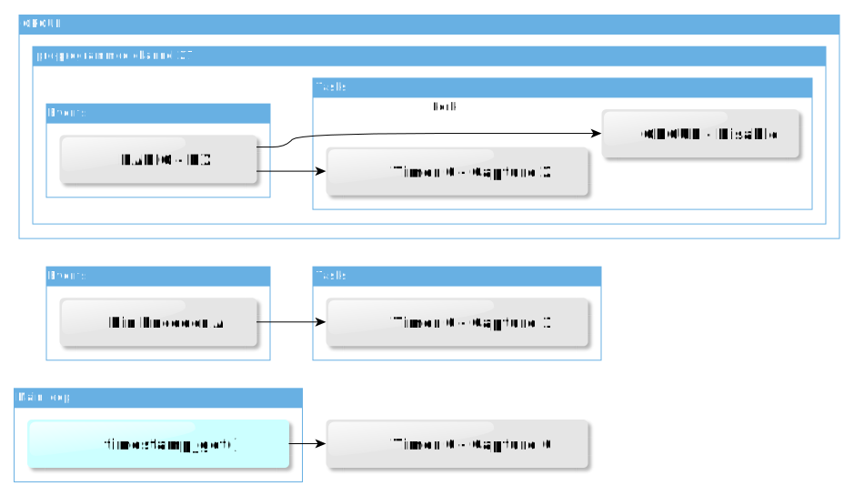

# nRF52 Sensor Tag
This board is based on modules, it is very simple to solder and allows selection of any other I²C sensor modules.

## Design
### Module


### Schematics
Here a screenshot of the schematics which design files are also available in the [board subdirectory](boards/nrf52_sensortag/pcb)


## Mounted PCBs
It is possible to mount either CR2032 or CR2477


It is based on a market available nRF52832 module seen below


## Low Power configuration
|Flags to clear|
--- |
| NRFX_UARTE_ENABLED |
| NRFX_UART_ENABLED | 
| UART_ENABLED | 
| UART0_ENABLED |
| NRF_FPRINTF_ENABLED |
| NRF_LOG_BACKEND_UART_ENABLED |
| NRF_LOG_STR_FORMATTER_TIMESTAMP_FORMAT_ENABLED |
| NRF_LOG_ENABLED |
* removed nrf_drv_uart.c from Makefile
* Required nRF52832 Errata [89] TWI: Static 400 uA current while using GPIOTE


## Low Power measures
| Mode | Current |
--- | --- |
| RTC + RAM | 9.6 uA |
| // + Sensors | 22 uA |
| // without TWI Woraround | 470 uA |
| Uart Log | 500 uA |
| Uart Log + HF | 700 uA |


# nRF52 Dongle
## Software
### RF to Serial Gateway
The node connected through serial port will report messages in text format
1. Local Events

Upon startup such message is sent

    nodeid:75;channel:10;reset:1

2. Listening

Upon activation of the uicr config ```is_listening``` the node starts acting as a gatewy that will report messages through serial in text mode

    rssi:-50;id:73;ctrl:0x81;src:73;alive:68;tx_power:0

3. commands requests and responses

It is possible to reconfigure the Node on runtime and manage manage a mesh network by sending messages

    cmd:0x0102
    cmd:0x<command id><arguments>

| Command id | Function | Parameters |
--- | --- | --- |
| 0x01 | Set Node Id | Node Mesh Short Identifier|
| 0x02 | Get Node Id | |
| 0x03 | Set RF Channel | 0:2400 MHz - 100:2500 MHz|
| 0x04 | Get RF Channel | |
| 0x05 | Set Tx Power | 0x04: +4dBm - 0xD8: -40dBm|
| 0x06 | Get Tx Power | |
| 0x07 | Set Bitrate | tbd |
| 0x08 | Get Bitrate |
| 0x09 | Set CRC | 0 : No CRC - 1 : 8bit - 2 : 16 bit|
| 0x0A | Get CRC |  |
| 0x0B | Set UICR | used uicr registers |
| 0x0C | Get UICR |  |


### Command examples
Set channel 10/0x0A

    cmd:0x030A

get channel

    cmd:0x04

Set Tx Power to  -4dBm/0xFC

    cmd:0x05FC

Set UICR e.g. RF Channel @ CUSTOMER[1] to channel 10

    cmd:0x0B010A

Send message, directed (not broadcast) with ttl = 2, ping(75/0x4B) from 73/0x49

    msg:0x7201494B

Send message to execute on the RF target node 75/0x4B the command Set Tx Power to -4 dBm

    msg:0x72EC494B05FC

Send message to execute on the RF target node 75/0x4B the command Set channel to 0x0A

    msg:0x72EC494B030A

Send request to execute on the RF target node 75/0x4B the command Set channel to 0x0A
The only difference to the previous example is that an intermediate ack for the request is not required before getting the response

    msg:0x22EC494B030A

### Switch between serial SERIAL and LOG over UART
run

    make conf

then switch both flags :
* nRF_Log/NRF_LOG_BACKEND_UART_ENABLED
* Application/APP_SERIAL_ENABLED
don't forget to save

### Serial mode
* NRF_SERIAL_MODE_IRQ flag is not used by the driver and has equivalent function as NRF_SERIAL_MODE_DMA

* ser_send() must be used with a variable in memory as DMA cannot read from Code in Flash

## Hardware

Why reinvent the wheel ? When it comes to a Server interface as a dongle, we can reuse a usb dongle from the market that includes a **2104** serial to usb converter. Keyword search on shopping websites : **nRF52832 USB dongle**. Aka "nRF52832-YJ-17017-USB-UART"


<br/>

## From the inside


<br/>

## pinout
| nRF52 | pin |
--- | --- |
| Rx | P0.05 |
| Tx | P0.06 |
| CTS | P0.07 |
| RTS | P0.08 |
| LED1 | P0.28 |
| LED2 | P0.29 |


## Needle adapter
Making a needle adapter is made easier with 3d printing. The used pogo pin is seen below


The adapter model still in preparation can be found [here](https://a360.co/2IcKZK9). It should look something like this:


<br/>


# Raspi Host Controller Interface

## HCI MQTT Test vector

### Commands
get mesh node id of attached dongle

    mosquitto_pub -t 'cmd/request/get_node_id' -m ''

Response

    cmd/response/get_node_id {"cmd": "get_node_id", "node_id": "73"}

get channel of attached dongle

    mosquitto_pub -t 'cmd/request/get_channel' -m ''

Response

    cmd/response/get_channel {"cmd": "get_channel", "channel": "2"}

### Remote Commands
Request to set remote node 74 on RF channel 2

    mosquitto_pub -t 'remote_cmd/request/set_channel' -m '{"channel":2,"remote":74}'

Response

    remote_cmd/response/set_channel {"pid": "236", "ctrl": "0x02", "src": "74", "dest": "73", "cmd": "set_channel", "set": "2", "get": "2"}

### Actions
Ping node 74

    mosquitto_pub -t 'Nodes/79/ping' -m '{"remote":"74"}'

Aknowledge

    Nodes/79/ack 1

# More nRF52 Applications
    cd ./applications/

## 02 acell tag
    application/02_accell_tag> make flash

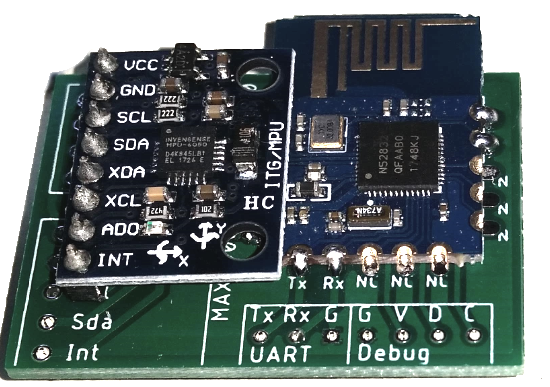

* Status : experimental, low battery life
* nRF52832 module
* MPU-6050 module
* interrupt pio from MPU-6050

## 03 buttons
    application/03_buttons> make flash

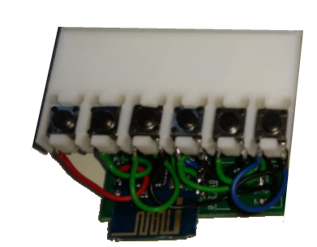

* Status : experiemntal, low battery life
* nRF52832 module
* x6 buttons

## 05 rotary decoder
    application/05_rotary_decoder> make flash

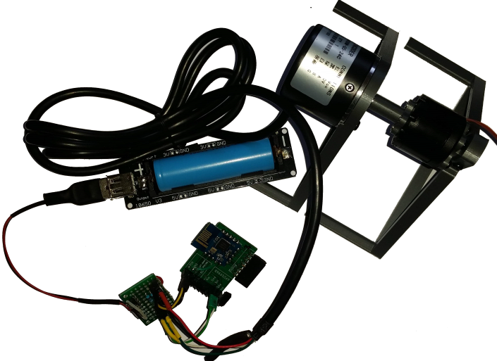

* buy : "600 pulses Optical Rotary encoder"
* custom wiring +5V, encoder pullups to +3.3 V
* rf timestamp synchronisation
* HW capture of timestamp
* RF Mesh log of modulo 600 position with timestamp
* 4 ms status on change, otherwise 4 s reminder


## 06 bldc 52832
    application/06_bldc_52832> make flash

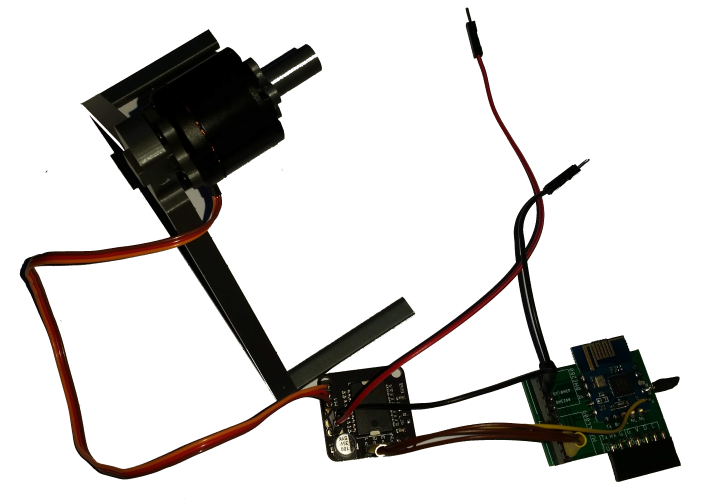

* Status : RF magnetic angle control OK, rest is in development
* nRF52832 sensor tag board used
* buy : "L6234d breakout"
* custom wiring power supply 9.6 V / nRF powered with 3.3 V separately
* RF bldc control : magnetic angle, voltage ratio, speed, absolute angle


## 07 bldc 52840
    application/07_usb_dongle> make flash

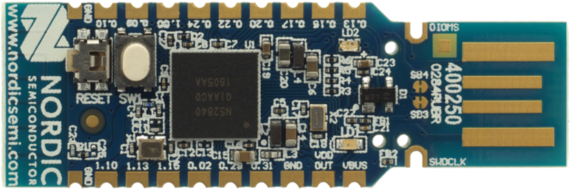

* Status : preparation
* previous application "03 bldc 52832" ported to the nRF52840-dongle


# Python scripts

    cd ./raspi/

## Raspberry pi scripts moved to [github raspi](https://github.com/HomeSmartMesh/raspi) Prject

Below is a description of the `raspi` directory, but the content is no longer updated and represents a draft in compaision to the follow up project with raspberry pi services and IoT Software stack : https://github.com/HomeSmartMesh/raspi

The server's python scripts running also on a raspberry pi
* ./raspi/hue : aqara sensors from mqtt to hue light automation through the hue gateway REST API
* ./raspi/rf_uart : the interface to the serial port that transfers data between MQTT and the RF mesh
* ./raspi/heat : eurotronics through zigbee2mqtt automation from aqara zigbee2mqtt windows contact sensors
* ./raspi/bathroom : fan automation controlled with button, shelly light switch and humidity sensor
* ./raspi/conbee : the ConBee script to turn the Xiaomi Zibbee devices events into MQTT
* ./raspi/rf_stm32 : interface to leagacy devices, bed heater and retro light
* ./raspi/mesh_wizard/ : The web interface for real time view of the mesh with webgl, uses a websocket to connect to the MQTT broquer
* ./raspi/ruler/ : json configurable rules through sensors and actuators MQTT topics and a separate python rules file
* ./raspi/influx/ : the [influx](https://www.influxdata.com/time-series-database/) client that listens to MQTT and grabs standard sesnors patterns to be sent to the database
* ./raspi/grafana : [Grafana](https://grafana.com/grafana) is used as a dashboard, it is a webserver interface that is installed on the raspberry pi (or on the docker image). Some dashboards examples are provided in this directory, where the queries are matching the way how the influx client has recorded the sensors data. 
* ./raspi/wemo/ : The wemo switch smart socket interface, provides power sensing and sends the Watt value to MQTT
* ./raspi/milight : The milight RF gateway client (require the wifi to RF milight bridge HW)
* Data collection into a time series database 
    
# Home Smart Mesh detailed design

Functions call graph. Fifos dataflow between interrupts and main loop.

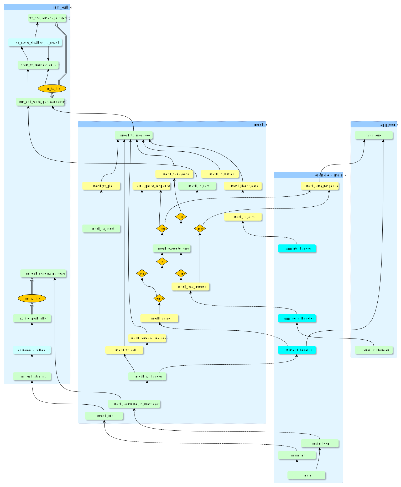


