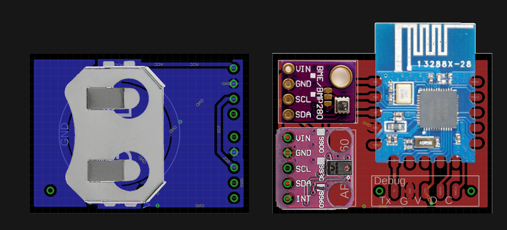

# What you'll find here
* nRF52 boards schematics and applications using the nRF SDK 15
* A light weight Mesh Protocol connecting all the devices using a custom RF protocol (without softdevice)

# Installation
* GNU Tools ARM Embedded version 6 2017-q2-update, referenced from the SDK Makefile.windows
* Python [jlink wrapper](https://github.com/square/pylink). Used in Makefile and tools of this repo, more on [pylink.readthedocs](http://pylink.readthedocs.io/en/latest/pylink.html). Note that it has to be used with a 32 bit python version referenced in the tools scripts as **C:\Python27\python.exe**. wrapper scripts already availabe in the tools directory


* System variable **NODES_CONFIG** should point on a json configuration file, see an example at [node.json](https://raw.githubusercontent.com/HomeSmartMesh/IoT_Frameworks/master/config/nodes.json) or the screenshot below


The parameters here are used by external tools to have a consistent undersanding of the mesh network. From simple id to name translation, to location display according to coordinates down to user data flashing.

## Cool defines and data configuration
### sdk config tool
Once in the application directory just use ```make conf``` to call a cmsis [configuration wizard](http://helmpcb.com/software/cmsis-configuration-wizard), as provided in the SDK. Note that it was here extended to make the user drivers shared and configurable as well, e.g. the I²C frequency of the **Application** in the screenshot


### Automated mesh devices configuration
 User data flashing is done with Pylink which reads in [uicr.py](tools\uicr.py) the registers of the attached device, look it up in the **NODES_CONFIG** file, retrives which parameters should be flashed, the mapping of parameters to CUSTOMER_X registers come from "uicr_map.json".


# nRF52 Sensor Tag
This board is based on modules, it is very simple to solder and allows selection of any other I²C sensor modules.



It is based on a market available nRF52832 module seen below


Here a screenshot of the schematics which design files are also available in the [board subdirectory](boards/nrf52_sensortag/pcb)


nRF52 Sensor Tag [readme](applications/nrf52_sensortag/README.md)

## Low Power configuration
|Flag to clear|
--- |
| NRFX_UARTE_ENABLED |
| NRFX_UART_ENABLED | 
| UART_ENABLED | 
| UART0_ENABLED |
| NRF_FPRINTF_ENABLED |
| NRF_LOG_BACKEND_UART_ENABLED |
| NRF_LOG_STR_FORMATTER_TIMESTAMP_FORMAT_ENABLED |
| NRF_LOG_ENABLED |
* removed nrf_drv_uart.c from Makefile

* Required nRF52832 Errata [89] TWI: Static 400 uA current while using GPIOTE


## Low Power measures
| Mode | Current |
--- | --- |
| RTC + RAM | 9.6 uA |
| // + Sensors | 22 uA |
| // without TWI Woraround | 470 uA |
| Uart Log | 500 uA |
| Uart Log + HF | 700 uA |


# nRF52 Dongle
Why reinvent the wheel ? When it comes to a Server interface as a dongle, we can reuse a usb dongle from the market that includes a **2104** serial to usb converter. Keyword search on shopping websites : **nRF52832 USB dongle**. Aka "nRF52832-YJ-17017-USB-UART"


<br/>

## From the inside


<br/>

## pinout
| nRF52 | pin |
--- | --- |
| Rx | P0.05 |
| Tx | P0.06 |
| CTS | P0.07 |
| RTS | P0.08 |
| LED1 | P0.28 |
| LED2 | P0.29 |
## Needle adapter
Making a needle adapter is made easier with 3d printing. The used pogo pin is seen below


The adapter model still in preparation can be found [here](https://a360.co/2IcKZK9). It should look something like this:


